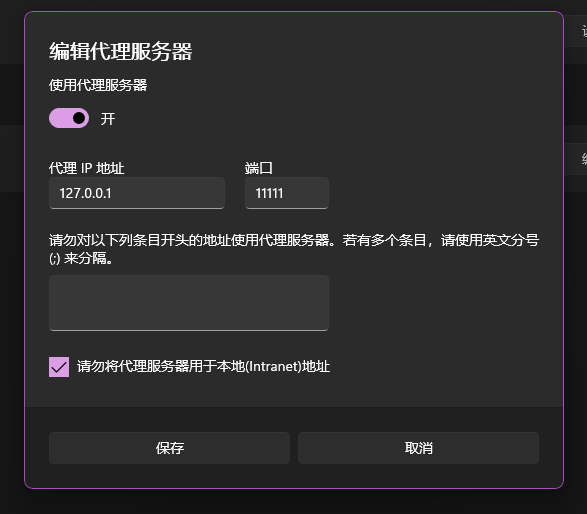
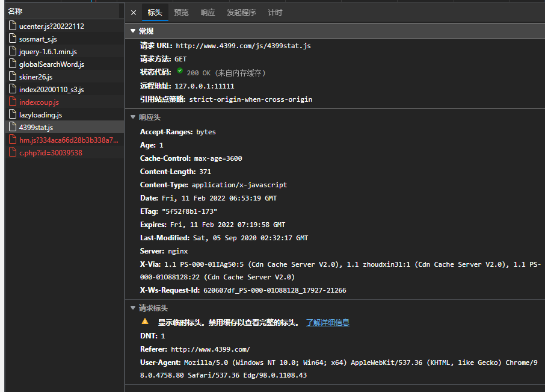
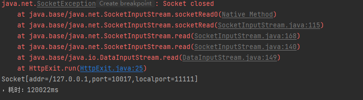

# HttpProxy

一个简单的Http代理服务，基于Socket服务，目前仅支持Connect Post Get三种请求。

代码主要通过java实现，其中运用了线程的接口完成实验任务。

使用方法，先运行此代码，然后再浏览器中配置代理，例如 127.0.0.1 8888

之后便可以通过此代理来完成实验。

## 实验实例：

在4399 测试get请求成功

在网站上进行登录测试 测试成功

idea 打印异常 socket closed 表示 socket关闭 由于并没有做请求结束后的操作 于是就直接打印出异常，返回在shell内。

# 实验结束

